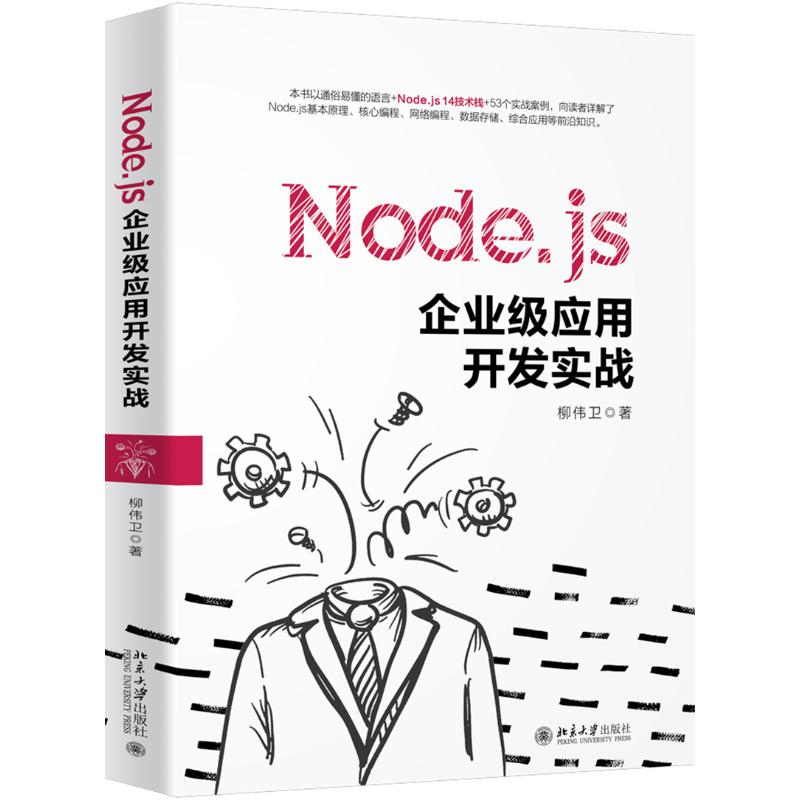

# Node.js Samples. （Node.js 案例大全）《Node.js企业级应用开发实战》源码

* [hello-world](samples/hello-world)：第一个Node.js应用
* [deep-strict-equal](samples/deep-strict-equal/)：deepStrictEqual示例
* [buffer-demo/character-encodings.js](samples/buffer-demo/character-encodings.js)：指定字符编码
* [buffer-demo/buffer-slice.js](samples/buffer-demo/buffer-slice.js)：切分缓冲区
* [buffer-demo/buffer-concat.js](samples/buffer-demo/buffer-concat.js)：连接缓冲区
* [buffer-demo/buffer-compare.js](samples/buffer-demo/buffer-compare.js)：比较缓冲区
* [buffer-demo/buffer-read.js](samples/buffer-demo/buffer-read.js)：缓冲区解码
* [buffer-demo/buffer-write.js](samples/buffer-demo/buffer-write.js)：缓冲区编码
* [events-demo/parameter-this.js](samples/events-demo/parameter-this.js)：监听事件
* [events-demo/parameter-lambda.js](samples/events-demo/parameter-lambda.js)：lambda方式监听事件
* [events-demo/set-immediate.js](samples/events-demo/set-immediate.js)：异步模式监听事件
* [events-demo/emitter-once.js](samples/events-demo/emitter-once.js)：仅处理事件一次
* [events-demo/error-event.js](samples/events-demo/error-event.js)：为error事件注册监听器
* [events-demo/event-names.js](samples/events-demo/event-names.js)：获取已注册的事件的名称
* [events-demo/event-listeners.js](samples/events-demo/event-listeners.js)：获取监听器数组的副本
* [events-demo/prepend-listener.js](samples/events-demo/prepend-listener.js)：将事件监听器添加到监听器数组的开头
* [events-demo/remove-listener.js](samples/events-demo/remove-listener.js)：移除监听器
* [fs-demo/fs-open.js](samples/fs-demo/fs-open.js)：打开文件
* [fs-demo/fs-read.js](samples/fs-demo/fs-read.js)：读取文件
* [fs-demo/fs-read-dir.js](samples/fs-demo/fs-read-dir.js)：读取目录
* [fs-demo/fs-read-file.js](samples/fs-demo/fs-read-file.js)：读取文件的全部内容
* [fs-demo/fs-write.js](samples/fs-demo/fs-write.js)：写入文件
* [fs-demo/fs-write-string.js](samples/fs-demo/fs-write-string.js)：将字符串写入文件
* [fs-demo/fs-write-file.js](samples/fs-demo/fs-write-file.js)：将数据写入文件
* [child-process/spawn-command.js](samples/child-process/spawn-command.js)：使用spawn
* [child-process/exec-command.js](samples/child-process/exec-command.js)：使用exec
* [child-process/exec-file.js](samples/child-process/exec-file.js)：使用execFile
* [stream-demo/stream-readable-event.js](samples/stream-demo/stream-readable-event.js)：readable事件
* [stream-demo/stream-pause.js](samples/stream-demo/stream-pause.js)：流停止触发data事件
* [stream-demo/stream-pipe.js](samples/stream-demo/stream-pipe.js)：绑定可写流到可读流
* [stream-demo/stream-read.js](samples/stream-demo/stream-read.js)：从内部缓冲拉取并返回数据
* [stream-demo/stream-unpipe.js](samples/stream-demo/stream-unpipe.js)：解除绑定
* [stream-demo/stream-async-iterator.js](samples/stream-demo/stream-async-iterator.js)：异步迭代器
* [stream-demo/stream-finish.js](samples/stream-demo/stream-finish.js)：finish事件
* [net-demo/create-server.js](samples/net-demo/create-server.js)：创建TCP服务器
* [net-demo/socket-write.js](samples/net-demo/socket-write.js)：TCP服务器的例子
* [net-demo/server-close.js](samples/net-demo/server-close.js)：关闭TCP服务器
* [dgram-demo/create-socket.js](samples/dgram-demo/create-socket.js)：创建UDP服务器
* [dgram-demo/socket-close.js](samples/dgram-demo/socket-close.js)：关闭UDP服务器
* [dgram-demo/upd-server.js](samples/dgram-demo/upd-server.js)：UDP服务器
* [dgram-demo/upd-client.js](samples/dgram-demo/upd-client.js)：UDP客户端
* [http-demo/hello-world.js](samples/http-demo/hello-world.js)：第一个HTTP服务器
* [http-demo/rest-service.js](samples/http-demo/rest-service.js)：构建REST服务的例子
* [ws-demo](samples/ws-demo)：WebSocket聊天服务器的例子
* [tls-demo/tls-server.js](samples/tls-demo/tls-server.js)：构建TLS服务器
* [tls-demo/tls-client.js](samples/tls-demo/tls-client.js)：构建TLS客户端
* [express-demo](samples/express-demo)：Express示例
* [express-rest](samples/express-rest)：Express REST 示例
* [socket-io-demo](samples/socket-io-demo)：Socket.IO示例
* [angular-demo](samples/angular-demo)：Angular应用的例子
* [mysql-demo](samples/mysql-demo)：操作MySQL的例子
* [mongodb-demo](samples/mongodb-demo)：操作MongoDB的例子
* [redis-demo](samples/redis-demo)：操作Redis的例子
* [user-management](samples/user-management)：内存版的“用户管理”客户端
* [user-management-rest](samples/user-management-rest)：“用户管理”服务端
* [user-management-ui](samples/user-management-ui)：与服务端对应的“用户管理”客户端

## 配套书籍《Node.js企业级应用开发实战》

与该源码配套的书籍《Node.js企业级应用开发实战》已经出版，内容详见全书[目录](SUMMARY.md)。

本书如有勘误，会在<https://github.com/waylau/nodejs-book-samples/issues>上进行发布。由于笔者能力有限，时间仓促，难免错漏，欢迎读者批评指正。

您也可以上[豆瓣](https://book.douban.com/subject/35148345/)给老卫打Call。

## 如何获取本书

实体店及各大网店有售。据我所知有如下网站供应：

* [京东](https://search.jd.com/Search?keyword=%E6%9F%B3%E4%BC%9F%E5%8D%AB%20Node.js%E4%BC%81%E4%B8%9A%E7%BA%A7%E5%BA%94%E7%94%A8%E5%BC%80%E5%8F%91%E5%AE%9E%E6%88%98&enc=utf-8&wq=%E6%9F%B3%E4%BC%9F%E5%8D%AB%20Node.js%E4%BC%81%E4%B8%9A%E7%BA%A7%E5%BA%94%E7%94%A8%E5%BC%80%E5%8F%91%E5%AE%9E%E6%88%98&pvid=cef388426fa443baac6fb59a1a133421)
* [1号店](https://search.yhd.com/c0-0/k%25E6%259F%25B3%25E4%25BC%259F%25E5%258D%25AB%2520Node.js%25E4%25BC%2581%25E4%25B8%259A%25E7%25BA%25A7%25E5%25BA%2594%25E7%2594%25A8%25E5%25BC%2580%25E5%258F%2591%25E5%25AE%259E%25E6%2588%2598/)
* [淘宝](https://s.taobao.com/search?q=%E6%9F%B3%E4%BC%9F%E5%8D%AB+Node.js%E4%BC%81%E4%B8%9A%E7%BA%A7%E5%BA%94%E7%94%A8%E5%BC%80%E5%8F%91%E5%AE%9E%E6%88%98&imgfile=&js=1&stats_click=search_radio_all%3A1&initiative_id=staobaoz_20200729&ie=utf8)
* [当当](http://search.dangdang.com/?key=%C1%F8%CE%B0%CE%C0%20Node.js%C6%F3%D2%B5%BC%B6%D3%A6%D3%C3%BF%AA%B7%A2%CA%B5%D5%BD&act=input)

想低于市价得到本书？来[二手书集市](https://github.com/waylau/second-hand-books)试试看。

也可以直接关注我博客（<https://waylau.com/>）或者我的开源书（<https://waylau.com/books/>）了解更多免费咨询。

## 联系作者:

您也可以直接联系我：

* 博客：https://waylau.com
* 邮箱：[waylau521(at)gmail.com](mailto:waylau521@gmail.com)
* 微博：http://weibo.com/waylau521
* 开源：https://github.com/waylau

## 其他书籍

若您对本书不感冒，笔者还写了其他方面的超过一打的书籍（可见<https://waylau.com/books/>），多是开源电子书。

本人也维护了一个[books-collection](https://github.com/waylau/books-collection)项目，里面提供了优质的专门给程序员的开源、免费图书集合。

二手书集市（<https://github.com/waylau/second-hand-books>），提供优质二手书交易。

## 开源捐赠

捐赠所得所有款项将用于开源事业！